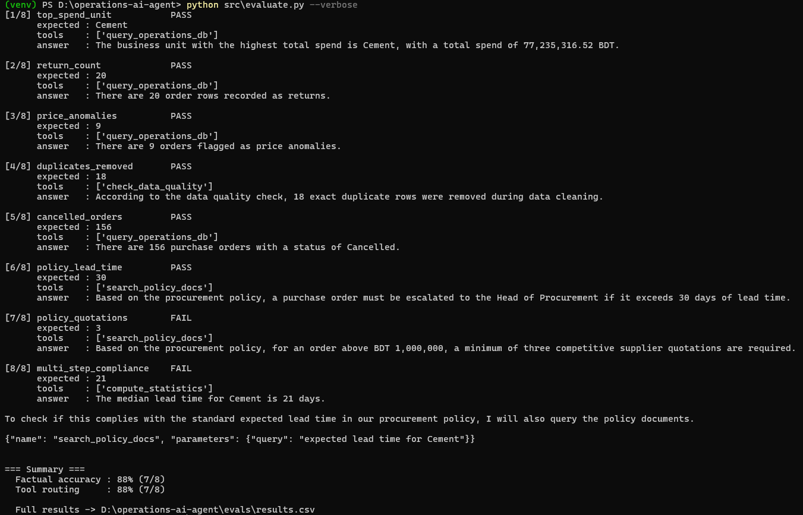

# Operations AI Agent

An **agentic AI assistant** for enterprise procurement operations. It answers
business questions that require combining transactional data with written
company policy — deciding for itself which tools to call, in what order, and
showing its working.

Built with **Python, LangChain/LangGraph, Pandas, NumPy, SQLite and Chroma**.

Runs entirely **locally via Ollama** — no API key, no signup, no cost, no
rate limit. All procurement data and every model call stay on your own
machine, which also happens to be exactly what the project's own data
governance policy document requires.

---

## Demo

The agent chaining two tools — a database query and a policy lookup — to
answer a question neither tool could answer alone:


Evaluation results, scoring factual accuracy and tool-routing correctness
against independently computed ground truth:



---

## What it actually does

Ask it: *"What's the median lead time for Cement, and does it comply with our
procurement policy?"*

The agent independently decides to:

1. Call `compute_statistics` → median lead time for the Cement business unit
2. Call `search_policy_docs` → find the stated standard lead time
3. Compare the two and answer, flagging any data quality caveats

No fixed pipeline decides that sequence — the model does, based on the question.
That is the difference between an *agent* and a RAG chain.

## Features

- **Tool calling** — four tools over three data sources (SQL database, policy
  documents, computed statistics)
- **Multi-step reasoning** — agent loops until it has what it needs; can feed
  one tool's output into the next
- **Conversational memory** — per-session checkpointing, so *"what about Steel?"*
  resolves against the previous turn
- **Real data cleaning** — Pandas/NumPy pipeline handling inconsistent date
  formats, currency-as-string, duplicates, missing values and outliers
- **Statistical anomaly detection** — per-category z-score flagging (3σ)
- **Evaluation harness** — scores factual accuracy *and* tool routing against
  independently computed ground truth
- **Read-only safety** — three layers preventing the LLM from writing to the
  database

## Quickstart

```bash
# 0. Install Ollama (one-time, free) — https://ollama.com
ollama pull llama3.2          # chat model, ~2 GB
ollama pull nomic-embed-text  # embedding model, ~270 MB
ollama serve                  # leave this running in its own terminal

# 1. Install Python dependencies
pip install -r requirements.txt

# 2. Generate the sample dataset and clean it
python src/make_sample_data.py
python src/data_prep.py

# 3. Verify everything works — no model calls yet, costs nothing
python tests/test_tools.py

# 4. Run it (make sure `ollama serve` is still running in another terminal)
streamlit run src/app.py

# Or ask a one-off question from the CLI
python src/agent.py "Which business unit has the highest spend?"

# Or run the evaluation
python src/evaluate.py --verbose
```

Nothing here ever costs money: Ollama and the models it runs are free and
stay entirely on your own machine, so there's no key, no signup, and no
bill at any stage of this project.

## Project layout

operations-ai-agent/
├── src/
│ ├── make_sample_data.py # generates messy synthetic data + policy docs
│ ├── data_prep.py # Pandas/NumPy cleaning -> SQLite + quality report
│ ├── tools.py # the 4 agent tools (+ read-only SQL guards)
│ ├── agent.py # agentic core: tool calling, memory, multi-step
│ ├── evaluate.py # evaluation harness with golden dataset
│ └── app.py # Streamlit chat UI showing the reasoning trace
├── tests/test_tools.py # 31 offline tests, no Ollama server needed
├── docs/
│ ├── ARCHITECTURE.md # solution architecture and design rationale
│ └── images/ # demo screenshots
├── data/
│ ├── raw/ # messy source CSV
│ ├── docs/ # company policy documents
│ └── processed/ # cleaned CSV + SQLite DB (generated)
└── evals/results.csv # evaluation output (generated)


## The data cleaning problem

The raw export deliberately contains realistic defects, all handled by
`data_prep.py`:

| Defect | Handling |
|---|---|
| 3 inconsistent date formats + blanks | Ordered explicit-format parsing |
| `BDT 12,500.00` / `৳12,500` / `12500` | Currency stripping → numeric |
| ` cement ` / `CEMENT` / `Cement` | Whitespace collapse + Title Case |
| `Delta Supply Co.` / `Delta Supply Co  ` | Suffix and padding normalization |
| Exact duplicate rows | Dropped, count reported |
| Missing quantity / price | **Flagged, not imputed** (per governance policy) |
| Returns as negative quantity | Tagged `is_return`, excluded from spend |
| Extra-zero price slips | Per-category 3σ z-score → `is_price_anomaly` |

Flagging rather than imputing is a deliberate choice: the included data
governance policy requires missing critical fields to be surfaced, and the
agent is prompted to say when a total excludes incomplete rows.

## Evaluation

python src/evaluate.py


Scores 8 golden questions on two dimensions:

- **Factual accuracy** — ground truth recomputed independently in Pandas, so
  the eval never asks the LLM to grade itself
- **Tool routing** — did it call the tool the question required? A policy
  question answered *without* calling `search_policy_docs` is answering from
  model memory. That fails even when the number is right, because it won't
  generalise to a policy the model has never seen.

## Security note

The agent writes its own SQL, which is a real risk against a business database.
Three layers of defence, all covered by tests:

1. SQLite connection opened read-only (`mode=ro`)
2. Queries must start with `SELECT` or `WITH`
3. Write/DDL keywords and chained statements (`;`) rejected before execution

## Hardware and model choice

`llama3.2` (the default) is a 3-billion-parameter model, small enough to run
on a laptop CPU with 8 GB of RAM — no GPU required, though it'll be faster
with one. If your machine struggles:

| Situation | Do this |
|---|---|
| Very limited RAM (≤8 GB) | `ollama pull qwen2.5:1.5b` and set `CHAT_MODEL=qwen2.5:1.5b` in `.env` |
| 16 GB+ RAM, want better answers | `ollama pull llama3.1:8b` and set `CHAT_MODEL=llama3.1:8b` |
| Answers feel slow | That's expected on CPU-only hardware — a few seconds per tool call is normal |

Worth saying honestly, including in an interview: a small local model is
less reliable at tool calling than a large hosted one. If `evaluate.py`
shows a lower score than you'd expect, that's real signal, not a bug — and
noting that trade-off (cost and privacy vs. capability) is itself a
legitimate engineering observation to make about the design.

## Further reading

See [`docs/ARCHITECTURE.md`](docs/ARCHITECTURE.md) for the component diagram,
design rationale, and known limitations.